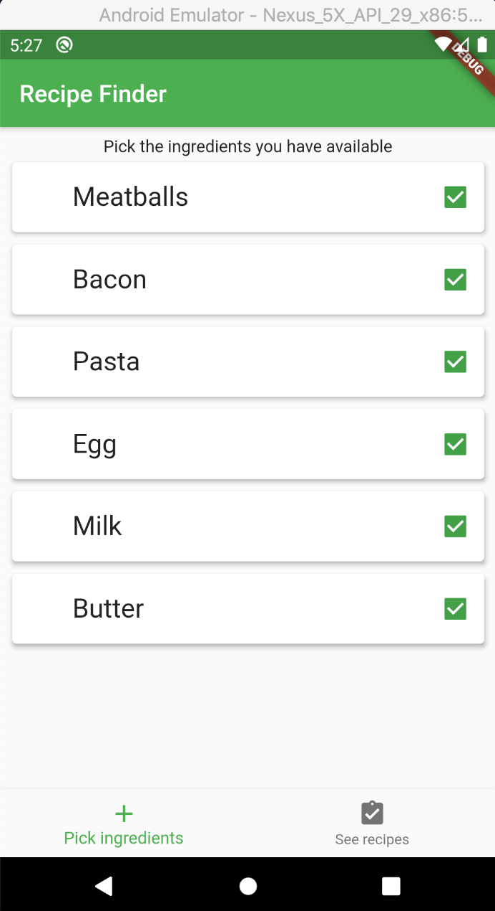
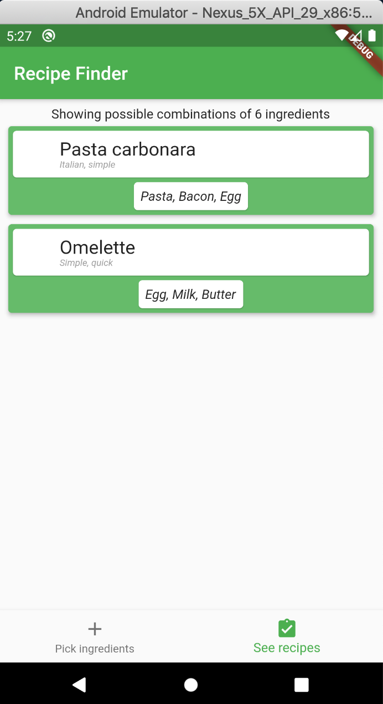

# recipefinderapp

A prototype application where the purpose is for the user to add any ingredients he or she has in the pantry, and for the smartphone to give all recipes that are possible to make from a database of recipes. Written in dart with the flutter SDK.

